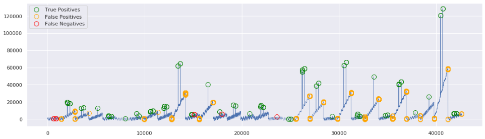

### Personal Learning Playground for Anomaly Detection

**S5 - A Labeled Anomaly Detection Dataset, version 1.0(16M)**

From Yahoo's description of the dataset: 
> "[...] The goal of this dataset is to benchmark your anomaly detection algorithm. The dataset consists of real and synthetic time-series with tagged anomaly points. The dataset tests the detection accuracy of various anomaly-types including outliers and change-points. The synthetic dataset consists of time-series with varying trend, noise and seasonality. The real dataset consists of time-series representing the metrics of various Yahoo services."

**yahoo_FFT.ipynb**  
- Experiments with a simple threshold model (Tukey's Fences)  
- Model saving/loading/benchmarking using the MLflow model registry.  
- Pre-processing and automatic de-seasoning by removal of dominant frequencies (FFT)   
- Using Area under PR and Area under ROC for benchmarking  

Result of selected model:

